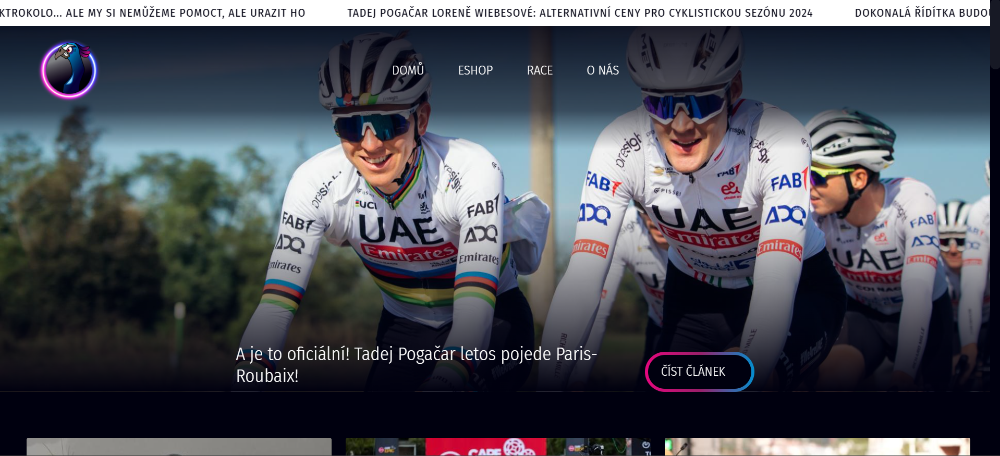
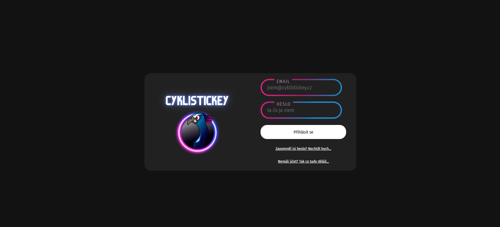
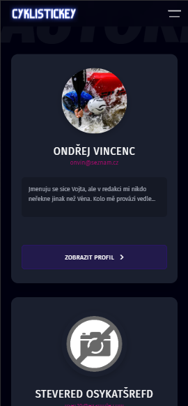
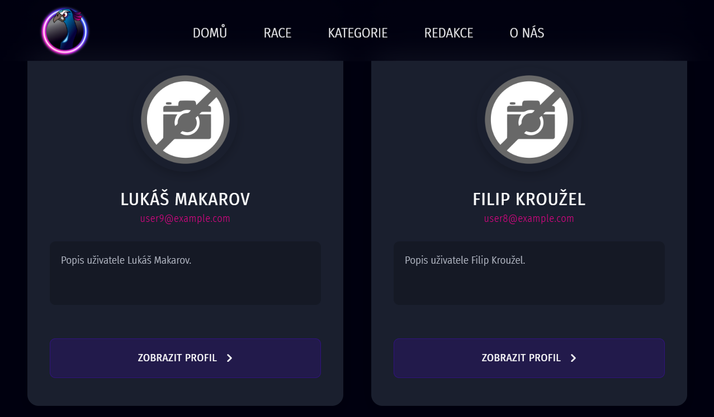
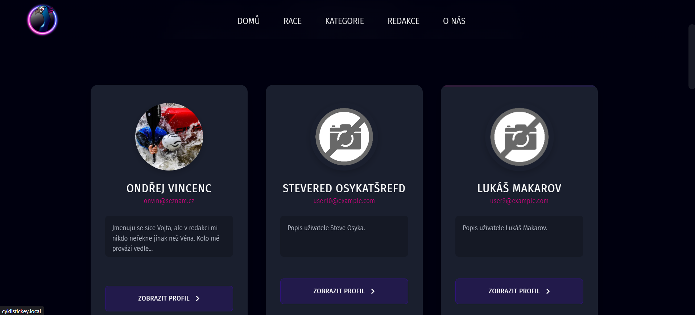
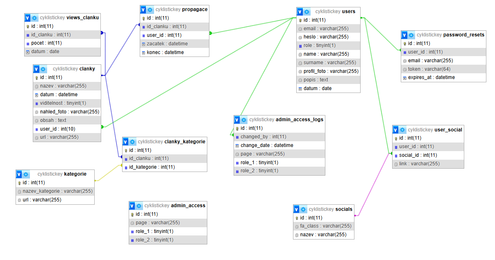

# 🚴 Redakční systém pro Cyklistický magazín

[](https://www.php.net/)
[](https://www.mysql.com/)
[](LICENSE)
[](https://www.cyklistickey.cz)

> Moderní redakční systém pro správu cyklistického magazínu - intuitivní, přehledný a bez zbytečných komplikací.

[🌐 Live Demo](https://www.cyklistickey.cz) | [📖 Dokumentace](#instalace) | [🐛 Issues](../../issues) | [💬 Discussions](../../discussions)

---

## 📋 Obsah

- [O projektu](#-o-projektu)
- [Screenshoty](#-screenshoty)
- [Funkce](#-funkce)
- [Tech Stack](#-tech-stack)
- [Architektura](#-architektura)
- [Instalace](#-instalace)
- [Konfigurace](#-konfigurace)
- [API Dokumentace](#-api-dokumentace)
- [Databázové schéma](#-databázové-schéma)
- [Bezpečnost](#-bezpečnost)
- [Performance](#-performance)
- [SEO](#-seo)
- [Deployment](#-deployment)
- [Testování](#-testování)
- [Troubleshooting](#-troubleshooting)
- [FAQ](#-faq)
- [Contributing](#-contributing)
- [Roadmap](#-roadmap)
- [Licence](#-licence)
- [Kontakt](#-kontakt)
- [Poděkování](#-poděkování)

---

## 🎯 O projektu

**Cyklistický magazín** je plnohodnotný redakční systém vytvořený pro správu obsahu cyklistického webu [cyklistickey.cz](https://www.cyklistickey.cz). Systém umožňuje tvorbu, úpravu a publikaci článků s pokročilými funkcemi jako je SEO optimalizace, statistiky, propagace a mnoho dalšího.

### Pro koho je to?

Nechtěl bych ti to komplikovat, takže jsem to udělal tak, aby to fungovalo pro:
- 👨‍💼 **Redaktory** - kteří potřebují psát články bez technických bolístek hlavy
- ✍️ **Editory** - kteří chtějí spravovat obsah a udržet kvalitu
- 🔧 **Administrátory** - kteří potřebují kontrolu nad vším

### Proč si vybrat tento systém?

- ⚡ **Jednoduché ovládání** - žádné složité menu, všechno na svém místě
- 📊 **Pokročilé statistiky** - zjisti, co lidi opravdu čtou
- 🔒 **Bezpečný** - ochrana proti všemu, co by mohlo škodit
- 🎨 **Moderní design** - funguje na mobilu, tabletu i počítači
- 🚀 **SEO friendly** - Google tě bude milovat

---

## 📸 Screenshoty

### Hlavní stránka

*Přehledná homepage s nejnovějšími články a propagovanými příspěvky*

### Admin Dashboard

*Intuitivní admin panel s rychlým přístupem ke všem funkcím*

### Editor článků
<div style="display: grid; grid-template-columns: 1fr 1fr; gap: 10px;">


</div>

*Pokročilý WYSIWYG editor s podporou obrázků, audio souborů a formátování*

### Login stránka

*Jednoduché přihlášení - "Nechtěl bych..."*

### Detail článku

*Čistý a přehledný design pro čtení článků*

### Statistiky
<div style="display: grid; grid-template-columns: repeat(3, 1fr); gap: 10px;">


</div>

*Detailní statistiky zobrazení a click tracking analytics*

### Responsive Design
<div style="display: grid; grid-template-columns: repeat(3, 1fr); gap: 10px;">





</div>

*Funguje perfektně na všech zařízeních*

---

## ✨ Funkce

### 🌐 Veřejná část

- 📰 **Správa článků** - Vytváření, editace, publikace a plánování článků s podporou různých formátů
- 🏷️ **Kategorie a tagy** - Hierarchická struktura kategorií, možnost přiřazení více kategorií k jednomu článku
- 👥 **Autoři a redakce** - Profily autorů s fotografiemi, biografiemi a odkazy na sociální sítě
- 🏁 **Events/Závody** - Správa závodů a eventů (Cyklistickey, Bezeckey)
- 📊 **Statistiky zobrazení** - Automatické počítání views u každého článku
- 🔊 **Audio soubory** - Možnost připojení MP3 audio stop k článkům pro poslech místo čtení
- 🖼️ **Správa obrázků** - Automatické generování thumbnailů (malé, střední, velké), optimalizace
- 🔗 **Click tracking** - Detailní sledování kliků na odkazy v článcích s geolokací a user agent info
- 📱 **Responsive design** - Plně responzivní design fungující na mobilu, tabletu i desktopu
- 🔍 **SEO optimalizace** - Meta tagy, structured data, sitemapy, canonical URLs

### 🎛️ Admin část

- 🏠 **Dashboard** - Přehledný dashboard s rychlým přístupem ke všem funkcím a statistikám
- ✏️ **WYSIWYG editor** - TinyMCE editor s pokročilými funkcemi (formátování, obrázky, videa, kód)
- 👤 **Správa uživatelů** - CRUD operace, role (Moderátor, Editor, Administrátor), sociální sítě
- 🔐 **Role-based access control** - Dynamické oprávnění podle databáze, různé úrovně přístupu
- 📈 **Pokročilé statistiky** - Detailní analytics článků, kategorií, autorů, výkonnostní metriky
- 📢 **Propagace článků** - Časově omezené propagace článků na homepage (zvýraznění)
- ⚡ **Flash news** - Marquee zprávy v hlavičce webu pro rychlé oznámení
- 📋 **Správa kategorií** - Vytváření, editace, mazání kategorií s SEO URL
- 🎯 **Click tracking analytics** - Detailní metriky kliků (IP, geolokace, device, referrer, scroll depth)
- 📝 **Logování** - Access logs, admin logs, error logs pro monitoring
- 🎨 **Správa reklam** - Upload a správa bannerů v článcích (časově omezené, frekvenční)
- 🏷️ **Automatický výběr kategorie** - Pokud autor při vytváření článku nevybere kategorii, automaticky se přiřadí výchozí kategorie "Aktuality"

### 🔧 Technické funkce

- 🔒 **Bezpečnost** - CSRF protection, SQL injection prevention, XSS protection, password hashing
- ⚡ **Performance** - Caching (sitemap cache), optimalizace dotazů, indexing, gzip compression
- 🌐 **SEO pokročilé** - Structured Data (JSON-LD), Open Graph, Twitter Cards, Image SEO, News sitemap
- 🔄 **301 Redirecty** - Automatické 301 redirecty pro staré URL (zachování SEO hodnoty, zpětná kompatibilita)
- 📊 **Analytics ready** - Meta Pixel (Facebook), Google Analytics připraveno k zapojení
- 🔄 **Migrace dat** - Nástroje a skripty pro migraci dat ze staré databáze
- 🐍 **Python skripty** - Fuzzy matching algoritmus pro automatické párování audio souborů s články

---

## 🛠️ Tech Stack

### Backend
- **PHP 7.4+** (doporučeno 8.0+) - hlavní programovací jazyk
- **MySQL 5.7+** / **MariaDB 10.4+** - databázový systém
- **Apache** s mod_rewrite nebo **Nginx** - webový server
- **PDO** - databázové připojení s prepared statements

### Frontend
- **HTML5** - moderní sémantický markup
- **CSS3** - custom styly, responsive design, flexbox, grid
- **JavaScript** - vanilla JS pro interaktivitu
- **TinyMCE 6** - WYSIWYG editor pro psaní článků
- **Font Awesome** - ikony

### Tools & Scripts
- **Python 3.x** - migrační skripty (fuzzy matching pro audio)
- **Hunspell** - kontrola pravopisu v češtině

### Libraries & Dependencies
- **ip-api.com** - geolokace pro click tracking (free tier, 45 req/min)

### Architektura & Patterns
- **MVC (Model-View-Controller)** - čistá separace business logiky, dat a prezentace
- **Custom Router** - regex based routing pro veřejnou i admin část
- **Middleware System** - AuthMiddleware pro kontrolu přihlášení a oprávnění
- **Helper Classes** - opakovaně použitelné pomocné třídy (SEO, Tracking, Text, Time, atd.)
- **Repository Pattern** - modely pro databázové operace

---

## 🏗️ Architektura

### MVC Struktura

Systém využívá čistou MVC architekturu pro maximální přehlednost a udržovatelnost kódu.

#### Models (`app/Models/`)
Obsahují veškerou logiku pro práci s databází:
- `Article.php` - správa článků (CRUD, related articles, views)
- `Category.php` - správa kategorií
- `User.php` - správa uživatelů a autentizace
- `AccessControl.php` - řízení přístupových práv
- `Promotion.php` - propagace článků
- `Statistics.php` - statistiky a metriky
- `LinkClickEvent.php` - detailní click tracking
- `FlashNewsJSON.php` - flash news zprávy
- `Event.php` - události/závody
- `Ad.php` - reklamy

#### Controllers (`app/Controllers/`)

**Web Controllers** (`Controllers/Web/`) - veřejná část:
- `HomeController.php` - homepage, kontakt, events, appka
- `ArticleController.php` - zobrazení článků
- `CategoryController.php` - kategorie a filtrace
- `UserController.php` - profily autorů
- `LinkTrackingController.php` - click tracking redirect

**Admin Controllers** (`Controllers/Admin/`) - administrace:
- `HomeAdminController.php` - admin dashboard
- `ArticleAdminController.php` - správa článků (CRUD, preview, upload)
- `CategoryAdminController.php` - správa kategorií
- `UserAdminController.php` - správa uživatelů a settings
- `StatisticsAdminController.php` - statistiky a analytics
- `PromotionAdminController.php` - správa propagací
- `AccessControlAdminController.php` - správa přístupových práv
- `FlashNewsJSONAdminController.php` - správa flash news
- `AdAdminController.php` - správa reklam
- `LinkClicksAdminController.php` - click tracking analytics

**Login Controller**:
- `LoginController.php` - přihlášení, registrace, reset hesla

#### Views (`app/Views/`)
Šablony pro zobrazení:
- `Web/` - šablony pro veřejnou část (články, kategorie, homepage)
- `Admin/` - šablony pro administraci (formuláře, tabulky, dashboard)
- `layouts/` - základní layouty (base, navbar, footer)

### Routing Systém

#### Veřejné routy (`web/index.php`)
```php
$routes = [
    '/' => [HomeController::class, 'index'],
    '/article/{url}' => [ArticleController::class, 'articleDetail'],
    '/category/{url}' => [CategoryController::class, 'listByCategory'],
    '/categories' => [CategoryController::class, 'index'],
    '/articles' => [ArticleController::class, 'index'],
    '/authors' => [UserController::class, 'index'],
    '/user/{username}' => [UserController::class, 'userDetail'],
    '/events' => [HomeController::class, 'events'],
    '/login' => [LoginController::class, 'showLoginForm'],
    '/track/{token}' => [LinkTrackingController::class, 'track'],
    // ... a mnoho dalších
];
```

Custom regex routing s podporou parametrů v URL.

#### Admin routy (`admin/index.php`)
Všechny admin routy začínají `/admin/` a jsou chráněny AuthMiddleware:
```php
$routes = [
    'articles' => [ArticleAdminController::class, 'index'],
    'articles/create' => [ArticleAdminController::class, 'create'],
    'articles/edit/{id}' => [ArticleAdminController::class, 'edit'],
    'statistics' => [StatisticsAdminController::class, 'index'],
    // ... atd.
];
```

### Middleware

**AuthMiddleware** (`app/Middleware/AuthMiddleware.php`):
- Kontrola přihlášení uživatele před vstupem do admin části
- Ověření role a oprávnění k jednotlivým stránkám
- Dynamická kontrola přístupu podle databázové tabulky `admin_access`
- Automatický redirect na login při neoprávněném přístupu
- Support pro 3 role: Moderátor (1), Editor (2), Administrátor (3)

### Helper Classes (`app/Helpers/`)

- `SEOHelper.php` - generování meta tagů, structured data, sitemap, canonical URLs
- `LinkTrackingHelper.php` - vytváření tracking linků, redirect handling
- `TextHelper.php` - práce s textem (URL generování, zkracování, sanitizace)
- `TimeHelper.php` - formátování datumů a časů (česká lokalizace)
- `CSRFHelper.php` - ochrana proti CSRF útokům (token generování a validace)
- `TrackingHelper.php` - Meta Pixel, Google Analytics integration
- `GeoLocationHelper.php` - geolokace IP adres (ip-api.com)
- `UserAgentHelper.php` - detekce prohlížeče, OS a zařízení
- `RateLimitHelper.php` - ochrana proti spamu a DDoS
- `AISEOHelper.php` - AI generování SEO meta tagů (volitelné)
- `LogHelper.php` - logování událostí do souborů
- `RedirectHelper.php` - bezpečné 301/302 redirecty s ochranou proti open redirect, mapování starých URL na nové (např. `/race` → `/events`)

---

## 📦 Instalace

### Požadavky

Než začneš, ujisti se, že máš:
- **PHP 7.4+** (doporučeno PHP 8.0 nebo vyšší)
- **MySQL 5.7+** nebo **MariaDB 10.4+**
- **Apache** s mod_rewrite nebo **Nginx**
- **PHP rozšíření**: PDO, pdo_mysql, mbstring, gd, json, fileinfo
- **Python 3.x** (volitelné, pro migrační skripty)

### Krok za krokem instalace

#### 1. Clone repository

```bash
git clone https://github.com/tvuj-username/cyklistickey-cms.git
cd cyklistickey-cms
```

#### 2. Vytvoř databázi

Přihlas se do MySQL/MariaDB a vytvoř novou databázi:

```sql
CREATE DATABASE cyklistickey CHARACTER SET utf8mb4 COLLATE utf8mb4_unicode_ci;
```

#### 3. Import databázového schématu

Importuj SQL soubor se strukturou databáze:

```bash
mysql -u root -p cyklistickey < config/db.sql
```

Nebo použij phpMyAdmin a importuj `config/db.sql`.

#### 4. Konfigurace databázového připojení

Uprav soubor `config/db.php` a nastav své databázové údaje:

```php
<?php
class Database
{
    private $host = 'localhost';
    private $db_name = 'cyklistickey';
    private $username = 'tvuj_username';
    private $password = 'tvoje_heslo';
    // ...
}
```

#### 5. Nastav oprávnění pro složky

```bash
chmod -R 755 web/uploads
chmod -R 755 logs
```

Nebo pokud máš problémy s oprávněními:

```bash
chmod -R 775 web/uploads
chmod -R 775 logs
```

#### 6. Konfigurace webového serveru

**Apache:**

DocumentRoot nastav na složku `web/`:

```apache
<VirtualHost *:80>
    ServerName tvuj-web.cz
    DocumentRoot /cesta/k/projektu/web
    
    <Directory /cesta/k/projektu/web>
        AllowOverride All
        Require all granted
    </Directory>
</VirtualHost>
```

**.htaccess** v rootu projektu by měl přesměrovat na `/web/` (už je nastavený).

**Nginx:**

```nginx
server {
    listen 80;
    server_name tvuj-web.cz;
    root /cesta/k/projektu/web;
    index index.php;

    location / {
        try_files $uri $uri/ /index.php?$query_string;
    }

    location /admin {
        try_files $uri $uri/ /admin/index.php?$query_string;
    }

    location ~ \.php$ {
        fastcgi_pass unix:/var/run/php/php8.0-fpm.sock;
        fastcgi_index index.php;
        fastcgi_param SCRIPT_FILENAME $document_root$fastcgi_script_name;
        include fastcgi_params;
    }
}
```

#### 7. Vytvoř prvního administrátora

Přihlas se do databáze a vytvoř uživatele s rolí 3 (Administrátor):

```sql
INSERT INTO users (jmeno, prijmeni, email, role, heslo, public_visible) 
VALUES ('Admin', 'System', 'admin@example.com', 3, '$2y$10$...hash...', 1);
```

**Poznámka:** Heslo musí být zahashované pomocí `password_hash()`. Můžeš použít online nástroj nebo vytvořit dočasný PHP skript:

```php
<?php
echo password_hash('tvoje_heslo', PASSWORD_DEFAULT);
?>
```

#### 8. První přihlášení

Otevři `/login` v prohlížeči a přihlas se s vytvořeným účtem. 

🎉 **Hotovo!** Systém je nainstalovaný a připravený k použití. Nechtěl bych, aby ti to dělalo problémy, takže pokud něco nefunguje, podívej se do sekce [Troubleshooting](#-troubleshooting).

---

## ⚙️ Konfigurace

### Databáze (`config/db.php`)

```php
<?php
class Database
{
    private $host = 'localhost';        // Databázový server
    private $db_name = 'cyklistickey';  // Název databáze
    private $username = 'root';         // Uživatelské jméno
    private $password = '';             // Heslo
    // ...
}
```

### SEO Konfigurace (`web/config/seo_config.json`)

Tento soubor obsahuje všechna SEO nastavení:

```json
{
    "site": {
        "name": "Cyklistický magazín",
        "url": "https://www.cyklistickey.cz",
        "description": "Sledujte nejnovější zprávy ze světa cyklistiky",
        "keywords": "cyklistika, kolo, závody, trénink",
        "language": "cs",
        "country": "CZ"
    },
    "social": {
        "facebook": "https://www.facebook.com/...",
        "instagram": "https://www.instagram.com/...",
        "youtube": "https://www.youtube.com/..."
    },
    "tracking": {
        "meta_pixel_id": "YOUR_PIXEL_ID",
        "google_analytics_id": "YOUR_GA_ID",
        "enabled": true
    }
}
```

### Apache (.htaccess)

Hlavní `.htaccess` v rootu projektu:

```apache
RewriteEngine On

# Přesměrování /web/admin na /admin
RewriteRule ^web/admin(.*)$ /admin$1 [L,R=301]

# Přesměrování ostatních požadavků na /web/
RewriteCond %{REQUEST_URI} !^/admin/
RewriteCond %{REQUEST_URI} !^/web/
RewriteRule ^(.*)$ /web/$1 [L]
```

V `web/.htaccess` jsou nastavení pro caching, gzip kompresi a security headers.

### Environment Variables (volitelné)

Pro produkční prostředí doporučujeme použít environment variables místo hardcodovaných hodnot:

```php
// config/db.php
private $host = getenv('DB_HOST') ?: 'localhost';
private $db_name = getenv('DB_NAME') ?: 'cyklistickey';
private $username = getenv('DB_USER') ?: 'root';
private $password = getenv('DB_PASS') ?: '';
```

---

## 📡 API Dokumentace

### Veřejné API Endpointy

| Metoda | Endpoint | Popis | Parametry |
|--------|----------|-------|-----------|
| GET | `/` | Homepage s nejnovějšími články | - |
| GET | `/article/{url}` | Detail článku | `url` - SEO URL článku |
| GET | `/category/{url}` | Články v kategorii | `url` - SEO URL kategorie |
| GET | `/categories` | Seznam všech kategorií | - |
| GET | `/articles` | Seznam všech článků | - |
| GET | `/authors` | Seznam autorů | - |
| GET | `/user/{username}` | Profil autora | `username` - URL jméno |
| GET | `/user/{username}/articles` | Články autora | `username` - URL jméno |
| GET | `/events` | Seznam eventů/závodů | - |
| GET | `/events/{year}/{name}` | Detail eventu | `year`, `name` |
| GET | `/race` | ⚠️ 301 Redirect na `/events` | - |
| GET | `/race/cyklistickey` | ⚠️ 301 Redirect na `/events` | - |
| GET | `/race/bezeckey` | ⚠️ 301 Redirect na `/events` | - |
| GET | `/kontakt` | Kontaktní stránka | - |
| GET | `/login` | Login formulář | - |
| POST | `/login/submit` | Přihlášení | `email`, `password` |
| GET | `/logout` | Odhlášení | - |
| GET | `/register` | Registrační formulář | - |
| POST | `/register/submit` | Registrace | `jmeno`, `prijmeni`, `email`, `heslo` |
| GET | `/reset-password` | Reset hesla | `token` (volitelné) |
| POST | `/reset-password/submit` | Žádost o reset | `email` |
| POST | `/reset-password/save` | Uložení nového hesla | `token`, `heslo` |
| GET | `/track/{token}` | Click tracking redirect | `token` - tracking token |
| GET | `/sitemap.xml` | Hlavní sitemap | - |
| GET | `/sitemap-images.xml` | Image sitemap | - |
| GET | `/sitemap-news.xml` | News sitemap | - |
| GET | `/robots.txt` | Robots.txt | - |

### Admin API Endpointy

Všechny admin endpointy vyžadují autentizaci a začínají `/admin/`. Přístup je kontrolován podle role uživatele.

#### Články

| Metoda | Endpoint | Popis | Role |
|--------|----------|-------|------|
| GET | `/admin/articles` | Seznam článků | 1, 2, 3 |
| GET | `/admin/articles/create` | Formulář nového článku | 1, 2, 3 |
| POST | `/admin/articles/store` | Uložení nového článku (automaticky přiřadí kategorii "Aktuality" pokud není vybrána) | 1, 2, 3 |
| GET | `/admin/articles/edit/{id}` | Editace článku | 1, 2, 3 |
| POST | `/admin/articles/update/{id}` | Update článku | 1, 2, 3 |
| POST | `/admin/articles/delete/{id}` | Smazání článku | 1, 2, 3 |
| GET | `/admin/articles/preview/{id}` | Náhled článku | 1, 2, 3 |
| POST | `/admin/upload-image` | Upload obrázku | 1, 2, 3 |

#### Kategorie

| Metoda | Endpoint | Popis | Role |
|--------|----------|-------|------|
| GET | `/admin/categories` | Seznam kategorií | 1, 2, 3 |
| GET | `/admin/categories/create` | Nová kategorie | 2, 3 |
| POST | `/admin/categories/store` | Uložení kategorie | 2, 3 |
| GET | `/admin/categories/edit/{id}` | Editace kategorie | 2, 3 |
| POST | `/admin/categories/update/{id}` | Update kategorie | 2, 3 |
| POST | `/admin/categories/delete/{id}` | Smazání kategorie | 2, 3 |

#### Uživatelé

| Metoda | Endpoint | Popis | Role |
|--------|----------|-------|------|
| GET | `/admin/users` | Seznam uživatelů | 2, 3 |
| GET | `/admin/users/edit` | Editace uživatele | 2, 3 |
| POST | `/admin/users/update` | Update uživatele | 2, 3 |
| POST | `/admin/users/delete` | Smazání uživatele | 2, 3 |
| GET | `/admin/settings` | Nastavení profilu | 1, 2, 3 |
| POST | `/admin/settings/update` | Update nastavení | 1, 2, 3 |

#### Statistiky

| Metoda | Endpoint | Popis | Role |
|--------|----------|-------|------|
| GET | `/admin/statistics` | Dashboard statistik | 1, 2, 3 |
| GET | `/admin/statistics/articles` | Statistiky článků | 1, 2, 3 |
| GET | `/admin/statistics/categories` | Statistiky kategorií | 1, 2, 3 |
| GET | `/admin/statistics/authors` | Statistiky autorů | 1, 2, 3 |

**Role:**
- 1 = Moderátor (omezený přístup)
- 2 = Editor (rozšířený přístup)
- 3 = Administrátor (plný přístup)

---

## 🗄️ Databázové schéma

### Hlavní tabulky

| Tabulka | Popis |
|---------|-------|
| `clanky` | Články (id, nazev, obsah, datum, viditelnost, user_id, url) |
| `kategorie` | Kategorie článků (id, nazev_kategorie, url) |
| `clanky_kategorie` | Vazební tabulka M:N mezi články a kategoriemi |
| `users` | Uživatelé systému (id, jmeno, prijmeni, email, role, heslo) |
| `promotions` | Propagované články (id, clanek_id, zacatek, konec) |
| `views_clanku` | Statistiky zobrazení článků |
| `link_click_events` | Detailní záznamy kliků na odkazy |
| `link_clicks` | Agregované statistiky kliků |
| `admin_access` | Přístupová práva podle role |
| `admin_access_logs` | Log změn v přístupových právech |
| `password_resets` | Tokeny pro reset hesla |
| `reklamy` | Reklamy a bannery |
| `flash_news` | Flash news zprávy |
| `events` | Události a závody |

### Entity Relationship Diagram



### Klíčové vztahy

- **clanky ↔ kategorie** - M:N přes `clanky_kategorie`
- **clanky → users** - M:1 (autor článku)
- **promotions → clanky** - M:1 (propagovaný článek)
- **link_click_events → clanky** - M:1 (kliknutí v článku)
- **views_clanku → clanky** - 1:1 (statistiky článku)

---

## 🔒 Bezpečnost

Systém implementuje několik vrstev zabezpečení:

### Ochrana proti útokům

- ✅ **SQL Injection** - Použití prepared statements (PDO) ve všech databázových dotazech
- ✅ **XSS (Cross-Site Scripting)** - Sanitizace všech výstupů pomocí `htmlspecialchars()`
- ✅ **CSRF (Cross-Site Request Forgery)** - CSRF tokeny v formulářích (CSRFHelper)
- ✅ **Password Security** - Hashování hesel pomocí `password_hash()` s bcrypt
- ✅ **Session Security** - Secure session handling, HTTPOnly cookies
- ✅ **File Upload Security** - Validace typu souborů, velikosti, bezpečné ukládání
- ✅ **Rate Limiting** - Ochrana proti brute-force a spam (RateLimitHelper)
- ✅ **Access Control** - Role-based permissions, dynamická kontrola přístupu

### Best Practices

```php
// ❌ ŠPATNĚ - SQL injection riziko
$query = "SELECT * FROM users WHERE email = '$email'";

// ✅ SPRÁVNĚ - Prepared statement
$stmt = $db->prepare("SELECT * FROM users WHERE email = ?");
$stmt->execute([$email]);
```

```php
// ❌ ŠPATNĚ - XSS riziko
echo $user_input;

// ✅ SPRÁVNĚ - Sanitizace
echo htmlspecialchars($user_input, ENT_QUOTES, 'UTF-8');
```

```php
// ❌ ŠPATNĚ - Plaintext heslo
$password = 'heslo123';

// ✅ SPRÁVNĚ - Hashování
$password = password_hash('heslo123', PASSWORD_DEFAULT);
```

### Security Headers

V `.htaccess` jsou nastaveny bezpečnostní hlavičky:

```apache
Header set X-Content-Type-Options "nosniff"
Header set X-Frame-Options "SAMEORIGIN"
Header set X-XSS-Protection "1; mode=block"
Header set Referrer-Policy "strict-origin-when-cross-origin"
```

---

## ⚡ Performance

### Implementované optimalizace

- 🚀 **Database Indexing** - Indexy na často používané sloupce (id, url, user_id)
- 🗜️ **Gzip Compression** - Komprese HTML, CSS, JS souborů (v `.htaccess`)
- 💾 **Browser Caching** - Cache hlavičky pro statické soubory (obrázky, CSS, JS)
- 🔄 **Sitemap Caching** - Sitemapy se cachují na 1 hodinu
- 🖼️ **Image Optimization** - Automatické generování thumbnailů (malé, střední, velké)
- 📊 **Query Optimization** - Optimalizované databázové dotazy, JOINy místo N+1
- 🎯 **Lazy Loading** - Obrázky se načítají až při zobrazení (v některých views)

### Cache mechanismus

```php
// Příklad: Sitemap cache
$cacheFile = __DIR__ . '/cache/sitemap.xml';
$cacheTime = 3600; // 1 hodina

if (file_exists($cacheFile) && (time() - filemtime($cacheFile)) < $cacheTime) {
    readfile($cacheFile);
    exit;
}

// Generování sitemapy...
file_put_contents($cacheFile, $sitemapContent);
```

### Performance tipy

- Pravidelně analyzuj slow queries pomocí MySQL slow query log
- Monitoruj velikost `uploads/` složky
- Používej CDN pro statické soubory (volitelné)
- Zvažuj Redis/Memcached pro session storage v produkci

---

## 🔍 SEO

Systém má zabudovanou pokročilou SEO optimalizaci na světové úrovni.

### Implementované SEO funkce

- ✅ **Meta Tags** - Automatické generování title, description, keywords pro každou stránku
- ✅ **Open Graph** - Facebook/LinkedIn sharing optimalizace
- ✅ **Twitter Cards** - Twitter sharing optimalizace
- ✅ **Structured Data (JSON-LD)** - Rich snippets pro Google (Article, NewsArticle, Person, Organization, BreadcrumbList)
- ✅ **Canonical URLs** - Prevence duplicate content
- ✅ **Sitemapy** - Hlavní sitemap, image sitemap, news sitemap (Google News)
- ✅ **Robots.txt** - Optimalizovaný robots.txt s odkazy na sitemapy
- ✅ **hreflang tags** - Pro mezinárodní verze (připraveno)
- ✅ **Image SEO** - Alt texty, sitemap s obrázky
- ✅ **Mobile-friendly** - Plně responzivní design
- ✅ **Page Speed** - Optimalizace rychlosti načítání
- ✅ **301 Redirecty** - Automatické 301 redirecty pro staré URL (zachování SEO hodnoty, zpětná kompatibilita)

### 301 Redirecty pro SEO

Systém automaticky přesměrovává staré URL na nové pomocí 301 redirectů, což zachovává SEO hodnotu a zajišťuje zpětnou kompatibilitu:

```php
// Příklad: Staré race URL → nové events URL
// /race → /events (301 redirect)
// /race/cyklistickey → /events (301 redirect)
// /race/bezeckey → /events (301 redirect)

// Použití RedirectHelper
RedirectHelper::permanent('/events'); // 301 redirect
```

**Výhody:**
- ✅ Zachování SEO hodnoty starých odkazů z Google
- ✅ Zpětná kompatibilita se starými sdílenými odkazy
- ✅ Automatické mapování starých URL na nové struktury
- ✅ Bezpečné redirecty s ochranou proti open redirect útokům

### SEOHelper třída

Automatické generování SEO:

```php
// Příklad použití v controlleru
$title = "Název článku";
$description = SEOHelper::generateDescription($article['obsah']);
$keywords = SEOHelper::extractKeywords($article['obsah'], 10);
$canonicalUrl = SEOHelper::generateCanonicalUrl("article/" . $article['url']);

// Structured Data
$structuredData = SEOHelper::generateNewsArticleSchema([
    'headline' => $article['nazev'],
    'datePublished' => $article['datum'],
    'author' => $author['jmeno'] . ' ' . $author['prijmeni'],
    'image' => $article['nahled_foto']
]);
```

### Google Search Console setup

1. Ověř web v [Google Search Console](https://search.google.com/search-console)
2. Přidej sitemapy:
   - `https://tvuj-web.cz/sitemap.xml`
   - `https://tvuj-web.cz/sitemap-images.xml`
   - `https://tvuj-web.cz/sitemap-news.xml`
3. Přidej web do [Google News Publisher Center](https://publishers.google.com/)

---

## 🚀 Deployment

### Produkční nasazení

#### 1. Server requirements
- Linux server (Ubuntu/Debian doporučeno)
- Apache 2.4+ nebo Nginx 1.18+
- PHP 8.0+
- MySQL 8.0+ nebo MariaDB 10.5+
- SSL certifikát (Let's Encrypt doporučeno)

#### 2. Příprava serveru

```bash
# Update systému
sudo apt update && sudo apt upgrade -y

# Instalace požadavků
sudo apt install apache2 mysql-server php8.0 php8.0-mysql php8.0-gd php8.0-mbstring -y

# Instalace Let's Encrypt
sudo apt install certbot python3-certbot-apache -y
```

#### 3. SSL certifikát

```bash
sudo certbot --apache -d tvuj-web.cz -d www.tvuj-web.cz
```

#### 4. Database backup

Nastav automatické zálohy databáze:

```bash
# Cron job pro denní zálohu (3:00 ráno)
0 3 * * * mysqldump -u root -p'heslo' cyklistickey > /backup/db_$(date +\%Y\%m\%d).sql
```

#### 5. Log rotation

Nastav rotaci logů v `/etc/logrotate.d/cyklistickey`:

```
/cesta/k/projektu/logs/*.log {
    daily
    rotate 14
    compress
    missingok
    notifempty
}
```

#### 6. Monitoring

Doporučené nástroje:
- **UptimeRobot** - monitoring dostupnosti
- **Google Analytics** - návštěvnost
- **New Relic / Datadog** - performance monitoring (volitelné)

---

## 🧪 Testování

### Manual testing checklist

#### Veřejná část
- [ ] Homepage načítání článků
- [ ] Detail článku (text, obrázky, audio)
- [ ] Kategorie - filtrace článků
- [ ] Profil autora
- [ ] Responsive design (mobil, tablet)
- [ ] Click tracking (klik na odkaz v článku)
- [ ] Flash news zobrazení
- [ ] Kontaktní formulář

#### Admin část
- [ ] Login/logout
- [ ] Vytvoření článku
- [ ] Editace článku
- [ ] Mazání článku
- [ ] Upload obrázků
- [ ] WYSIWYG editor funkcionalita
- [ ] Správa kategorií
- [ ] Správa uživatelů
- [ ] Statistiky zobrazení
- [ ] Click tracking analytics
- [ ] Propagace článků
- [ ] Flash news správa
- [ ] Access control (role permissions)

#### Bezpečnost
- [ ] SQL injection test
- [ ] XSS test
- [ ] CSRF protection
- [ ] File upload security
- [ ] Password reset flow
- [ ] Session security

#### Browser compatibility
- ✅ Chrome/Edge (Chromium)
- ✅ Firefox
- ✅ Safari
- ✅ Mobile browsers (iOS Safari, Chrome Mobile)

---

## 🔧 Troubleshooting

### Časté problémy a řešení

#### ❌ Database connection error

**Problém:** "Connection error: SQLSTATE[HY000] [1045] Access denied"

**Řešení:**
1. Zkontroluj `config/db.php` - správné credentials
2. Ověř, že MySQL běží: `sudo systemctl status mysql`
3. Zkontroluj oprávnění uživatele v MySQL:
```sql
GRANT ALL PRIVILEGES ON cyklistickey.* TO 'username'@'localhost';
FLUSH PRIVILEGES;
```

#### ❌ 404 na všech stránkách kromě homepage

**Problém:** URL rewriting nefunguje

**Řešení:**
1. Zapni mod_rewrite: `sudo a2enmod rewrite`
2. Restart Apache: `sudo systemctl restart apache2`
3. Zkontroluj `.htaccess` a že máš `AllowOverride All` ve VirtualHost

#### ❌ Permission denied při uploadu souborů

**Problém:** Nelze nahrát obrázky/soubory

**Řešení:**
```bash
sudo chown -R www-data:www-data web/uploads
sudo chmod -R 775 web/uploads
```

#### ❌ Session problémy (neustálé odhlašování)

**Problém:** Session se neukládá

**Řešení:**
1. Zkontroluj session.save_path v `php.ini`
2. Nastav oprávnění: `sudo chmod 1733 /var/lib/php/sessions`
3. Zkontroluj `session.cookie_secure` v php.ini (vypni na non-HTTPS)

#### ❌ Sitemap prázdný/chybný

**Problém:** Sitemap generování nefunguje

**Řešení:**
1. Smaž cache: `rm web/cache/sitemap*.xml`
2. Zkontroluj databázi - články s `viditelnost = 1`
3. Zkontroluj log: `tail -f logs/error.log`

#### ❌ SEO meta tagy se nezobrazují

**Problém:** Meta tagy v `<head>` chybí

**Řešení:**
1. Zkontroluj, že controller volá `SEOHelper::setMetaTags()`
2. Ověř, že `base.php` layout obsahuje `<?php SEOHelper::renderMetaTags(); ?>`
3. Zkontroluj `web/config/seo_config.json`

### Debug mode

Pro debugging zapni error reporting v `web/index.php`:

```php
// Na začátek souboru
error_reporting(E_ALL);
ini_set('display_errors', 1);
```

**⚠️ POZOR:** V produkci vždycky vypni!

### Log files

- `logs/error.log` - PHP chyby
- `logs/access.log` - HTTP requesty
- `logs/admin.log` - Admin akce
- `logs/login.log` - Login pokusy

---

## ❓ FAQ

### Jak vytvořím nový admin účet?

Registrace na `/register` vytvoří běžný účet. Pro admin přístup musí stávající admin změnit roli v databázi nebo přes admin panel (Správa uživatelů).

### Jak přidám novou kategorii?

Admin panel → Kategorie → Vytvořit novou kategorii. Zadej název a SEO URL se vygeneruje automaticky.

### Jak funguje click tracking?

Click tracking automaticky sleduje kliknutí na všechny odkazy v článcích. Data obsahují IP (geolokace), user agent (device, OS, browser), referrer, scroll depth a timestamp.

### Jak nastavím propagaci článku?

Admin panel → Propagace → Vytvořit novou propagaci. Vyber článek, začátek a konec propagace. Propagované články se zobrazují na homepage.

### Jak migruji data ze staré databáze?

Použij skript `web/migrate_db.php`. Nastav připojení ke staré DB a spusť skript. Detaily v `migrace_mapovani.md`.

### Jak přidám audio soubor k článku?

Nahraj MP3 soubor do `web/uploads/audio/` s názvem `{id_clanku}.mp3`. Systém ho automaticky zobrazí v článku.

### Jak resetuji heslo?

Na `/login` klikni na "Zapomněl jsi heslo?" a zadej email. Dostaneš link pro reset.

### Jak změním design/barvy?

Styly jsou v `web/css/`. Hlavní barva (#f1008d) je definovaná v `main-page.css` a dalších CSS souborech.

---

## 🤝 Contributing

Příspěvky jsou vítány! Pokud chceš přispět:

### Postup

1. **Fork** repository
2. **Vytvoř branch** pro svou feature: `git checkout -b feature/amazing-feature`
3. **Commit** změny: `git commit -m 'Add amazing feature'`
4. **Push** do branchi: `git push origin feature/amazing-feature`
5. **Otevři Pull Request**

### Code Style

- **PHP**: PSR-12 standard
- **Indentace**: 4 mezery
- **Encoding**: UTF-8
- **Line endings**: LF (Unix)
- **Komentáře**: v češtině nebo angličtině

### Commit Messages

```
feat: Add user profile page
fix: Fix SQL injection in search
docs: Update README installation guide
style: Format code according to PSR-12
refactor: Optimize article query
test: Add tests for authentication
```

### Code of Conduct

- Buď ohleduplný a respektující
- Konstruktivní feedback
- Žádné osobní útoky nebo nenávistné komentáře
- Pomoč ostatním v Issues a Discussions

---

## 🗺️ Roadmap

### Plánované funkce

- [ ] **Text-to-Speech** - Automatické převádění článků na audio pomocí TTS
- [ ] **AI generování článků** - Integrace s OpenAI API pro automatické generování obsahu
- [ ] **Video chat integrace** - Live rozhovory s autory/závodníky
- [ ] **RSS Feed** - RSS feed pro čtenáře článků
- [ ] **Vícejazyčnost** - Podpora více jazyků (EN, SK)
- [ ] **PWA** - Progressive Web App pro offline čtení
- [ ] **Komentáře** - Systém komentářů pod články
- [ ] **Newsletter** - E-mailový newsletter s novými články
- [ ] **Dark mode** - Tmavý režim pro lepší čtení v noci
- [ ] **Elasticsearch** - Pokročilé vyhledávání v článcích

### Detailní TODO

Pro kompletní seznam úkolů viz [TODO.md](TODO.md).

---

## 📄 Licence

Tento projekt je licencován pod **MIT Licencí**.

```
MIT License

Copyright (c) 2024 Cyklistický magazín

Permission is hereby granted, free of charge, to any person obtaining a copy
of this software and associated documentation files (the "Software"), to deal
in the Software without restriction, including without limitation the rights
to use, copy, modify, merge, publish, distribute, sublicense, and/or sell
copies of the Software, and to permit persons to whom the Software is
furnished to do so, subject to the following conditions:

The above copyright notice and this permission notice shall be included in all
copies or substantial portions of the Software.

THE SOFTWARE IS PROVIDED "AS IS", WITHOUT WARRANTY OF ANY KIND, EXPRESS OR
IMPLIED, INCLUDING BUT NOT LIMITED TO THE WARRANTIES OF MERCHANTABILITY,
FITNESS FOR A PARTICULAR PURPOSE AND NONINFRINGEMENT. IN NO EVENT SHALL THE
AUTHORS OR COPYRIGHT HOLDERS BE LIABLE FOR ANY CLAIM, DAMAGES OR OTHER
LIABILITY, WHETHER IN AN ACTION OF CONTRACT, TORT OR OTHERWISE, ARISING FROM,
OUT OF OR IN CONNECTION WITH THE SOFTWARE OR THE USE OR OTHER DEALINGS IN THE
SOFTWARE.
```

Viz [LICENSE](LICENSE) pro více detailů.

---

## 📞 Kontakt

**Cyklistický magazín**

- 📧 Email: [jsem@cyklistickey.cz](mailto:jsem@cyklistickey.cz)
- 🌐 Web: [www.cyklistickey.cz](https://www.cyklistickey.cz)
- 📱 Telefon: +420 608 644 786

### Sociální sítě

- 📘 [Facebook](https://www.facebook.com/profile.php?id=100094700727442)
- 📸 [Instagram](https://www.instagram.com/cyklistickey/)
- 🎥 [YouTube](https://www.youtube.com/@cyklistickey)
- 🎵 [TikTok](https://www.tiktok.com/@cyklistickey)

### GitHub

- 🐛 [Issues](../../issues) - Nahlášení bugů a feature requestů
- 💬 [Discussions](../../discussions) - Diskuze a otázky
- 🔀 [Pull Requests](../../pulls) - Příspěvky do projektu

---

## 🙏 Poděkování

### Technologie

Tento projekt by nebyl možný bez:

- [PHP](https://www.php.net/) - programovací jazyk
- [MySQL](https://www.mysql.com/) - databáze
- [TinyMCE](https://www.tiny.cloud/) - WYSIWYG editor
- [Font Awesome](https://fontawesome.com/) - ikony
- [ip-api.com](https://ip-api.com/) - geolokační služba

### Inspirace

- [WordPress](https://wordpress.org/) - inspirace pro admin panel
- [Ghost](https://ghost.org/) - inspirace pro editor
- [Medium](https://medium.com/) - inspirace pro čtecí UX

### Contributors

Děkujeme všem, kteří přispěli k tomuto projektu! 🎉

---

<div align="center">

**Nechtěl bych, aby ti něco chybělo, takže pokud máš otázky, neváhej se ozvat!**

Made with ❤️ for cycling enthusiasts 🚴‍♂️

[⬆ Zpět nahoru](#-redakční-systém-pro-cyklistický-magazín)

</div>

