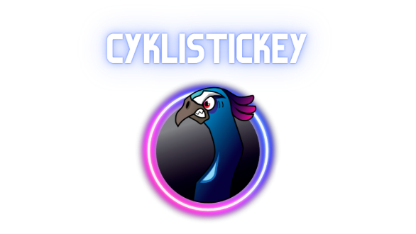
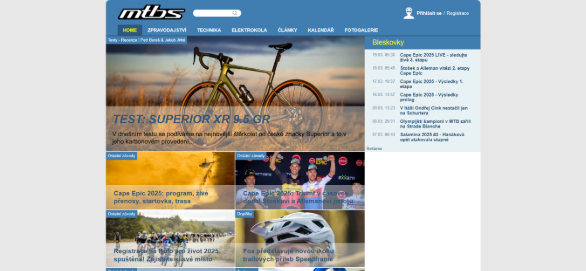
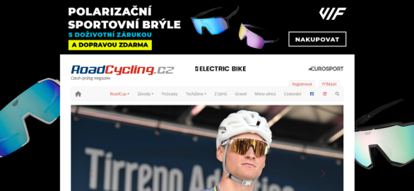
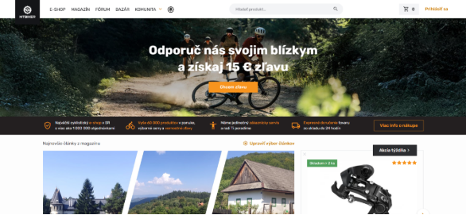

**Redakční systém pro cyklistický magazín**

**Obsah**

[**ÚVOD		9****](#_toc512415384)

[**1	ANALÝZA OBDOBNÝCH WEBOVÝCH STRÁNEK	10****](#_toc512415385)

[**1.1	ZAPIŠTE NÁZEV PRVNÍHO WEBU	10****](#_toc512415386)

[*1.1.1	Kladné stránky	10**](#_toc512415387)

[*1.1.2	Záporné stránky	10**](#_toc512415388)

[**1.2	ZAPIŠTE NÁZEV PRVNÍHO WEBU	10****](#_toc512415386)

[*1.2.1	Kladné stránky	10**](#_toc512415387)

[*1.2.2	Záporné stránky	10**](#_toc512415388)

[**1.3	ZAPIŠTE NÁZEV PRVNÍHO WEBU	10****](#_toc512415386)

[*1.3.1	Kladné stránky	10**](#_toc512415387)

[*1.3.2	Záporné stránky	10**](#_toc512415388)

[**2	NÁVRH PROJEKTU	11****](#_toc512415389)

[**2.1	CÍLOVÉ SKUPINY	11****](#_toc512415390)

[**2.2	ADMINISTRACE WEBU	11****](#_toc512415391)

[**2.3	DATABÁZE	11****](#_toc512415392)

[**2.4	DESIGN A RESPONZIVITA	11****](#_toc512415393)

[**3	POPIS PROJEKTU	12****](#_toc512415394)

[**3.1	FRONTEND	12****](#_toc512415395)

[**3.2	BACKEND	12****](#_toc512415396)

[**ZÁVĚR	13****](#_toc512415397)

[**SEZNAM PŘÍSTUPOVÝCH ÚDAJŮ	14****](#_toc512415398)

[**SEZNAM POUŽITÉ LITERATURY A ZDROJŮ OBRÁZKŮ	15****](#_toc512415399)

[**SEZNAM OBRÁZKŮ	16****](#_toc512415400)

[**PŘÍLOHY	17****](#_toc512415401)

# **Úvod**
Tato maturitní práce se zabývala vývojem redakčního systému pro cyklistický magazín cyklistickey.cz, který představuje komplexní řešení pro správu a publikování specializovaného obsahu. Výsledný systém splňuje všechny požadavky stanovené v zadání a úspěšně naplňuje svůj účel – poskytovat redakci efektivní nástroj pro publikování článků a čtenářům příjemné prostředí pro konzumaci obsahu.

V rámci přípravné fáze byly analyzovány existující řešení (roadcycling.cz, mtbiker.sk a mtbs.cz), což umožnilo identifikovat jejich silné stránky i nedostatky. Tyto poznatky byly následně zohledněny při návrhu vlastního systému, který implementuje osvědčené postupy a zároveň nabízí inovativní prvky, jako je integrace audio obsahu nebo pokročilé statistiky čtenosti.

Technologicky je projekt postaven na moderním stacku – PHP s objektově orientovaným přístupem a MVC architekturou pro backend, MySQL pro databázovou vrstvu, a HTML5, CSS3 a JavaScript s frameworkem Bootstrap 5 pro frontend. Tato kombinace zajišťuje nejen robustnost a udržitelnost kódu, ale také optimální uživatelský zážitek napříč různými zařízeními.

Značnou pozornost jsem během vývoje věnoval bezpečnostním aspektům. Systém implementuje:

- Ochranu proti SQL injection útokům pomocí parametrizovaných dotazů (prepared statements)
- Obranu proti XSS útokům prostřednictvím důsledného escapování výstupu (htmlspecialchars)
- Bezpečné ukládání hesel s využitím hashování (password\_hash)
- Propracovaný systém řízení přístupu založený na uživatelských rolích

Mezi klíčové funkce implementovaného systému patří:

- Intuitivní WYSIWYG editor pro vytváření a editaci článků
- Flexibilní kategorizace obsahu s možností přiřazení článku do více kategorií
- Systém pro správu multimediálního obsahu včetně obrázků a audio nahrávek
- Propracované statistické nástroje pro sledování čtenosti jednotlivých článků
- Responzivní design optimalizovaný pro všechny typy zařízení
- Modulární architektura umožňující snadné rozšiřování funkcionality

Během vývoje jsem byl konfrontován s několika technickými výzvami, zejména v oblasti optimalizace výkonu při práci s multimediálním obsahem a implementaci efektivního systému řízení přístupu. Tyto problémy byly úspěšně vyřešeny díky kombinaci důkladné analýzy, experimentování s různými přístupy a iterativního testování.

V rámci budoucího rozvoje projektu by bylo vhodné implementovat:

- Pokročilou ochranu proti CSRF útokům prostřednictvím tokenů pro všechny formuláře
- Systém pro uživatelské komentáře s možností moderace
- ` `Automatickou integraci se sociálními sítěmi pro sdílení nového obsahu
- Mobilní aplikaci synchronizovanou s webovou verzí systému
- Pokročilé analytické nástroje pro detailnější analýzu uživatelského chování
- Systém personalizovaných doporučení obsahu pro registrované uživatele

Z osobního hlediska mi tento projekt poskytl cennou příležitost propojit teoretické znalosti získané během studia s praktickými dovednostmi potřebnými pro vývoj reálné webové aplikace. Získané zkušenosti z oblasti webových technologií, databázového návrhu, bezpečnostních principů a responzivního designu představují solidní základ pro mé další profesní působení v oblasti vývoje webových aplikací.

Redakční systém nabízí mnoho možností pro budoucí rozšíření. V další fázi vývoje by bylo možné implementovat:

• Pokročilý systém komentářů s moderací a reakcemi

• Automatickou integraci se sociálními sítěmi pro sdílení obsahu

• Nativní mobilní aplikaci synchronizovanou s webovým rozhraním

• Rozšířené analytické nástroje pro detailnější sledování uživatelského chování

• Systém personalizovaných doporučení obsahu pro přihlášené uživatele

• Implementaci systému flashnews, který je plánován jako součást budoucího vývoje

Vývojové procesy a metodologie: Projekt byl vyvíjen podle agilních principů s využitím Scrum metodologie. Vývoj probíhal v iteracích, přičemž každá iterace přinášela nové funkce nebo vylepšení stávajících. Pro správu verzí byl využit Git, což umožnilo efektivní spolupráci a sledování změn v kódu. Testování bylo prováděno průběžně, včetně unit testů pro kritické komponenty systému a integračních testů pro ověření správné funkčnosti celého řešení. Dokumentace byla průběžně aktualizována a doplňována o nové funkce a změny v systému.

Historie a kontext projektu: Vývoj redakčního systému pro cyklistický magazín započal v reakci na rostoucí poptávku po specializovaných nástrojích pro správu obsahu v oblasti cyklistických webů. V posledních letech se cyklistika stala jedním z nejpopulárnějších sportů a volnočasových aktivit, což vedlo k nárůstu počtu cyklistických webů a magazínů. Tyto weby často používají obecné CMS systémy, které nejsou optimalizovány pro specifické potřeby cyklistického obsahu. Tato skutečnost vytvořila prostor pro vývoj specializovaného řešení, které by lépe odpovídalo požadavkům redakcí cyklistických webů.

Výzvy a řešení: Během vývoje projektu jsme narazili na několik výzev, které bylo potřeba překonat. Jednou z hlavních výzev byla optimalizace výkonu při práci s multimediálním obsahem, zejména s velkými obrázky a audio soubory. Tento problém byl vyřešen implementací efektivního systému pro kompresi a cachování médií. Další výzvou byla implementace pokročilého systému pro správu oprávnění, který by umožnil flexibilní nastavení přístupových práv pro různé role uživatelů. Tato výzva byla překonána vytvořením modulárního systému oprávnění, který lze snadno rozšiřovat a upravovat podle potřeb.

Inovace a unikátní prvky: Projekt přináší několik inovativních řešení, která ho odlišují od běžných redakčních systémů. Jedním z unikátních prvků je integrovaný systém pro správu audio obsahu, který umožňuje redaktorům snadno přidávat a spravovat zvukové nahrávky přímo v rámci článků. Další inovací je pokročilý systém pro sledování návštěvnosti, který poskytuje detailní analýzy chování čtenářů a pomáhá redakci optimalizovat obsah. Systém také implementuje moderní přístupy k responzivnímu designu, což zajišťuje optimální zobrazení obsahu na všech typech zařízení.

Budoucí perspektivy: Vytvořený redakční systém má potenciál pro další rozvoj a vylepšení. V budoucnu by bylo možné implementovat pokročilé funkce jako umělá inteligence pro automatickou kategorizaci článků, personalizované doporučení obsahu pro čtenáře nebo automatické generování shrnutí článků. Další možností je rozšíření systému o mobilní aplikaci, která by umožnila redaktorům pracovat na článcích i v terénu. Systém je navíc navržen tak, aby byl snadno integrovatelný s dalšími službami a platformami, což otevírá možnosti pro budoucí rozšíření funkcionality.

1. # **Analýza obdobných webových stránek**
Analýza obdobných webových stránek je klíčovým krokem při vývoji redakčního systému pro cyklistický magazín. Tato analýza nám umožňuje identifikovat běžné funkce, dobré praktiky a případné nedostatky existujících řešení. Pro účely tohoto projektu jsem se zaměřil výhradně na české a slovenské cyklistické weby, které představují přímou konkurenci a zároveň mohou poskytnout cennou inspiraci. Na základě těchto poznatků můžeme navrhnout systém, který bude kombinovat osvědčené postupy a zároveň nabídne inovativní řešení problémů, se kterými se potýkají existující weby.
1. ## **MTBS.CZ**
Adresa: https://www.mtbs.cz

MTBS.cz je specializovaný český web zaměřený na horskou cyklistiku, který nabízí články, recenze, technické tipy a informace o závodech. Tento web má dlouhou historii a velkou komunitu českých MTB jezdců.

1. ### **Kladné stránky**
- Silné komunitní prvky, včetně diskusních fór a možnosti sdílení tras
- Dobře strukturovaný katalog recenzí vybavení s možností porovnání
- Přehledná správa událostí a závodů s kalendářem a upozorněními
- Jednoduchá a přímočará navigace s důrazem na obsah
- Pravidelné aktualizace obsahu udržující komunitu aktivní
  1. ### **Záporné stránky**
- Zastaralejší design, který nepůsobí moderně ve srovnání s konkurencí
- Omezené mobilní rozhraní, které není plně optimalizované
- Absence pokročilých multimediálních prvků (360° fotografie, interaktivní grafy)
- Méně propracovaný systém propagace vybraných článků na hlavní stránce
- Absence integrace s audio obsahem nebo podcasty

  1. ## **ROADCYCLING.CZ**
Adresa: https://www.roadcycling.cz

RoadCycling je český web specializovaný na silniční cyklistiku, který se zaměřuje především na zpravodajství ze závodů, recenze silničních kol a technické články. Web poskytuje aktuální informace z domácí i světové silniční cyklistické scény.

1. ### **Kladné stránky**
- Specializovaný obsah zaměřený výhradně na silniční cyklistiku
- Kvalitní zpravodajství ze závodů s detailním obsahem a fotodokumentací
- Přehledné členění obsahu do tematických sekcí
- Propracované recenze vybavení s důrazem na technické detaily
- Kvalitní fotografie a videa doplňující textový obsah
  1. ### **Záporné stránky**
- Méně propracovaný responzivní design na mobilních zařízeních
- Absence pokročilých filtrů pro vyhledávání v archivech článků
- Omezená interaktivita a možnosti zapojení uživatelů
- Jednodušší systém administrace bez pokročilých redakčních funkcí
- Chybějící personalizace obsahu pro registrované uživatele
  1. ## **MTBIKER.SK**
Adresa: https://www.mtbiker.sk

MTBiker je slovenský web, který má silnou pozici i v české cyklistické komunitě. Zaměřuje se primárně na horskou cyklistiku, ale pokrývá i další disciplíny. Vyniká zejména rozsáhlým bazarem a velmi aktivní komunitou.

1. ### **Kladné stránky**
- Unikátní kombinace redakčního obsahu a komunitní platformy
- Rozsáhlý bazar s přehlednou kategorizací a vyhledáváním
- Kvalitní databáze tras s možností filtrování podle obtížnosti a lokality
- Aktivní fórum s rychlými reakcemi na dotazy uživatelů
- Integrované prvky sociální sítě pro cyklisty (profily, fotogalerie)
  1. ### **Záporné stránky**
- Místy přehlcené uživatelské rozhraní s velkým množstvím informací
- Komplikovaná navigace pro nové uživatele
- Delší doba načítání některých sekcí díky množství obsahu
- Omezené možnosti přizpůsobení zobrazovaného obsahu
- Absence audio obsahu a pokročilých multimediálních prvků

1. # **Návrh projektu**
Kapitola "Návrh projektu" se zabývá detailním plánováním redakčního systému pro cyklistický magazín. Zde jsou definovány cílové skupiny uživatelů, struktura administračního rozhraní, databázový model a design webu. Tato kapitola je klíčová pro pochopení, jak byl systém navržen a jaké technologie a postupy byly zvoleny pro jeho implementaci. Následující podkapitoly poskytují podrobné informace o každé z těchto oblastí.

HOMEPAGE 5. OBRÁZEK

1. ## **Cílové skupiny**
Redakční systém je navržen jako budoucí verze webu cyklistickey.cz, který je určen pro širokou veřejnost se zájmem o cyklistiku. Web je koncipován tak, aby si v něm každý našel to své - od začátečníků, kteří se teprve seznamují s cyklistikou, přes rekreační jezdce až po profesionální závodníky.
1. ### **Začátečníky a příležitostní cyklisti**
- Základní informace o cyklistice a tipy pro začátečníky
- Rady pro výběr vybavení a kola
- Bezpečnostní doporučení a pravidla silničního provozu
- Inspirace pro první výlety a trasy
- Audio verze článků pro pohodlné poslouchání během jiných aktivit
  1. ### **Rekreační jezdci**
- Tipy na zajímavé trasy a výlety
- Recenze vybavení a doplňků
- Články o tréninku a kondici
- Zprávy o cyklistických událostech v regionu
- Možnost sdílení vlastních zážitků a zkušeností
  1. ### **Zkušení cyklisti a závodníci**
- Detailní technické články a analýzy
- Zpravodajství ze závodů a profesionální scény
- Pokročilé tréninkové tipy a metodiky
- Recenze profesionálního vybavení
- Specializované sekce pro různé disciplíny (silniční, horská, dráhová cyklistika)
  1. ### **Veřejnost**
- Přehledné kategorizace článků podle témat a úrovně
- Možnost vyhledávání podle zájmů a zkušeností
- Audio verze článků pro alternativní konzumaci obsahu
- Aktuální zprávy a novinky ze světa cyklistiky
- Interaktivní prvky pro lepší zapojení do komunity
  1. ## **Administrace webu**
Administrační rozhraní je klíčovou součástí redakčního systému, která umožňuje správu veškerého obsahu a nastavení magazínu. Rozhraní je navrženo s důrazem na přehlednost, intuitivnost a efektivitu práce redaktorů a administrátorů. Implementace vychází z aktuálních potřeb redakce cyklistického magazínu a zahrnuje všechny nezbytné funkce pro efektivní správu obsahu.

HOMEPAGE ADMIN 6. OBRAZEK

1. ### **Hlavní sekce administračního rozhraní:**
- Dashboard – přehledová stránka s nejdůležitějšími informacemi (počet článků, statistiky návštěvnosti, nejnovější komentáře, rozpracované články)
- Správa článků – sekce pro vytváření, editaci, publikování a mazání článků, včetně možnosti nahrávání obrázků a audio souborů
- Správa kategorií – možnost vytvářet, upravovat a mazat kategorie pro třídění článků
- Správa uživatelů – přidávání, editace a mazání uživatelských účtů, správa rolí a oprávnění
- Statistiky – podrobné informace o návštěvnosti jednotlivých článků, kategorií a celého webu
- Nastavení – konfigurace systému, nastavení SEO parametrů, možnosti pro propojení se sociálními sítěmi
  1. ### **Dashboard (úvodní přehled):**
- Přehledová stránka poskytující souhrn nejdůležitějších informací
- Seznam nejnovějších článků s indikací jejich stavu (publikováno/koncept)
- Rychlý přístup k základním funkcím systému
- Základní statistiky návštěvnosti
  1. ### **Správa článků:**
- WYSIWYG editor pro pohodlnou tvorbu a úpravu článků
- Nahrávání a správa obrázků včetně vytváření náhledů
- Možnost plánování publikace článků
- Systém pro přiřazení článků do kategorií
- Nastavení SEO parametrů jako URL (slug) článků
- Volba viditelnosti článku (publikováno/koncept)
- Integrace s audio soubory pro zvukové verze článků
- Vyhledávání a filtrování článků podle různých kritérií
- Řazení článků podle ID, názvu, data a viditelnosti

WYSIWYG 7. OBRÁZEK

1. ### **Správa kategorií:**
- Vytváření a editace kategorií pro třídění článků
- Přiřazování článků do kategorií
- Nastavení SEO-friendly URL pro kategorie
  1. ### **Správa uživatelů:**
- Vytváření a správa uživatelských účtů
- Nastavení uživatelských rolí a oprávnění
- Editace profilových informací uživatelů
- Zabezpečené ukládání hesel pomocí hashovacích funkcí
  1. ### **Správa propagovaných článků:**
- Možnost zvýraznit vybrané články na hlavní stránce
- Nastavení priorit propagovaných článků
  1. ### **Přístupová práva:**
- Konfigurace přístupů k různým částem administrace
- Omezení funkcí podle uživatelské role
  1. ### **Statistiky:**
- Sledování počtu zobrazení jednotlivých článků
- Přehled čtenosti podle kategorií
- Základní analýza návštěvnosti
  1. ### **Technické specifikace administrace:**
- Implementace v PHP s využitím objektově orientovaného přístupu
- Responzivní design založený na frameworku Bootstrap 5
- Zabezpečený přístup s využitím autentizace a autorizace
- Ochrana proti běžným webovým útokům (SQL injection, XSS)
- Optimalizace pro rychlé načítání a práci s obsahem

Administrační rozhraní je navrženo tak, aby ho mohli efektivně používat i méně technicky zdatní uživatelé. Intuitivní ovládání, přehledná navigace a konzistentní design přispívají k efektivitě práce redakčního týmu. Systém poskytuje všechny potřebné nástroje pro správu obsahu cyklistického magazínu a může být v budoucnu dále rozšiřován podle rostoucích potřeb redakce.

ER DIAGRAM  8. OBRÁZEK

1. ## **Databáze**
Databázová struktura projektu je navržena s ohledem na efektivní ukládání a správu veškerého obsahu cyklistického magazínu. Pro implementaci byla zvolena relační databáze MySQL, která poskytuje dobrou kombinaci výkonu, spolehlivosti a flexibility.
1. ### **Hlavní databázové tabulky:**
- clanky – uchovává informace o všech článcích (id, nazev, obsah, datum, viditelnost, user\_id, nahled\_foto, url, audio)
- kategorie – obsahuje seznam kategorií (id, nazev\_kategorie, url)
- clanky\_kategorie – vazební tabulka pro vztah M:N mezi články a kategoriemi (id\_clanku, id\_kategorie)
- users – informace o uživatelích systému (id, email, heslo, name, surname, role, profil\_foto, zahlavi\_foto, popis)
- views\_clanku – statistiky zobrazení článků (id\_clanku, pocet)
- admin\_access – konfigurace přístupových práv k různým částem administrace (page, role\_1, role\_2)
  1. ### **Vztahy mezi tabulkami:**
- Články mohou patřit do více kategorií a kategorie mohou obsahovat více článků (vztah M:N realizovaný pomocí vazební tabulky clanky\_kategorie)
- Každý článek má přiřazeného autora – uživatele (vztah 1:N mezi users a clanky)
- Každý článek má svůj záznam v tabulce views\_clanku pro sledování počtu zobrazení (vztah 1:1)

Struktura tabulky clanky zahrnuje všechny potřebné atributy pro správu článků, včetně polí pro ukládání cesty k nahraným souborům (nahled\_foto pro úvodní obrázek a audio pro zvukovou stopu). Pole viditelnost určuje, zda je článek publikován a zobrazuje se na webu, nebo je uložen jako koncept. Pole url uchovává SEO-friendly URL adresu článku odvozenou z jeho názvu.

Databáze je navržena s ohledem na výkon a škálovatelnost. Pro optimalizaci dotazů jsou vytvořeny vhodné indexy na často používaných polích (id, user\_id, url). Referenční integrita je zajištěna pomocí cizích klíčů, které zabraňují vzniku nekonzistentních dat (např. nelze smazat kategorii, která obsahuje články, bez předchozího ošetření).
1. ## **Design a responzivita**
Design webového magazínu je navržen s důrazem na čistotu, přehlednost a snadnou orientaci. Vizuální styl odpovídá zaměření na cyklistiku – využívá dynamických prvků, sportovní barevné schéma a dostatek prostoru pro kvalitní fotografie.

BAREVNE SCHEMA A TYPOGRAFIE  9. OBRÁZEK

1. ### **Klíčové principy designu:**
- Minimalistický přístup s důrazem na obsah – čisté pozadí, kontrastní typografie pro snadnou čitelnost
- Hierarchické uspořádání prvků na stránce – důležité informace a hlavní články jsou zvýrazněny velikostí a umístěním
- Konzistentní vizuální prvky napříč celým webem – jednotný styl tlačítek, odkazů, nadpisů a menu
- Intuitivní navigace – přehledné horizontální menu s hlavními kategoriemi a doplňkové vertikální menu pro další funkce
- Efektivní využití "bílého prostoru" pro oddělení jednotlivých obsahových bloků

Responzivita je klíčovým aspektem designu, který zajišťuje optimální zobrazení na všech zařízeních od mobilních telefonů přes tablety až po desktopové počítače. Implementace responzivity využívá CSS framework Bootstrap 5, který poskytuje flexibilní grid systém a předdefinované komponenty pro různé velikosti obrazovek.

RESPONZIVITA   /PŘÍLOHA

- PC - 10. OBRÁZEK
- TABLET - 11. OBRÁZEK
- MOBIL - 12. OBRÁZEK

1. ### **Responzivní prvky:**
- Fluidní layout, který se automaticky přizpůsobuje šířce obrazovky
- Flexibilní obrázky, které mění svou velikost v závislosti na dostupném prostoru
- Přeskupení obsahu na menších obrazovkách - např. změna rozložení ze 3 sloupců na 1 pro mobilní telefony
- Přizpůsobení navigačního menu – na malých obrazovkách se horizontální menu transformuje na "hamburger menu"
- Optimalizace formulářů a interaktivních prvků pro dotykové ovládání

Testování responzivity bylo provedeno na různých zařízeních a v různých prohlížečích, aby byla zajištěna konzistentní uživatelská zkušenost bez ohledu na způsob přístupu k webu. Díky důslednému použití responzivních technik je zajištěno, že čtenáři mohou pohodlně konzumovat obsah magazínu kdekoli a kdykoli.

1. # **Popis projektu**
   1. ## **Frontend**
Frontend projektu představuje veřejnou část webového magazínu, se kterou interagují běžní čtenáři. Je navržen tak, aby poskytoval rychlý a intuitivní přístup k obsahu, zajímavý vizuální zážitek a optimální funkčnost na všech zařízeních.

HLAVNÍ STRÁNKA – KLICOVE KOMPONENTY  13. OBRÁZEK

1. ### **Struktura frontendové části:**
- Úvodní stránka - zobrazuje nejnovější a propagované články, přehled kategorií a stručné statistiky
- Stránky kategorií - výpis článků patřících do konkrétní kategorie s možností filtrování a řazení
- Detail článku - zobrazení kompletního obsahu článku včetně multimediálních prvků a přehrávače audia
- Profil autora - informace o autorovi s přehledem jeho článků
- Vyhledávání - funkce pro vyhledávání článků podle klíčových slov s rozšířenými filtry
  1. ### **Technologická implementace frontendové části využívá:**
- HTML5 pro strukturu stránek
- CSS3 a Bootstrap 5 pro stylování a responzivitu
- JavaScript pro interaktivní prvky a dynamické načítání obsahu
- PHP šablony pro generování HTML na serveru

Každá stránka je optimalizována pro rychlé načítání - obrázky jsou komprimovány a načítány v odpovídající velikosti podle zařízení, JavaScript je minimalizován a CSS optimalizován. Implementace lazy-loadingu zajišťuje, že náročnější prvky (jako obrázky mimo viditelnou oblast nebo audio přehrávače) se načítají až ve chvíli, kdy se uživatel dostane do jejich blízkosti.

Zvláštní pozornost byla věnována přehrávači audio obsahu, který je plně integrován do stránky článku. Přehrávač umožňuje základní ovládání (play/pause, posun v nahrávce, změna hlasitosti) a je optimalizován i pro mobilní zařízení. Audio soubory jsou ukládány ve formátech MP3 a OGG pro zajištění kompatibility s různými prohlížeči. 

DETAIL ČLÁNKU – AUDIO, MULTIMEDIA  14. OBRÁZEK

PROFIL AUTORA   15. OBRÁZEK

1. ## **Backend**
Backend projektu zajišťuje veškerou logiku aplikace, komunikaci s databází a generování obsahu pro frontend. Je implementován v PHP s využitím objektově orientovaného přístupu a MVC architektury pro lepší organizaci kódu a snadnou údržbu.
1. ### **Architektura backendu:**
   1. #### ***Modely (App/Models) - reprezentují datové entity a zajišťují komunikaci s databází***
- Article.php - správa článků včetně kategorií a statistik
- Category.php - operace s kategoriemi
- User.php - správa uživatelů a autentizace
- AccessControl.php - řízení přístupu a oprávnění
- Statistics.php - sběr a analýza statistických dat
  1. #### ***Kontrolery (App/Controllers) - zpracovávají požadavky uživatelů a propojují modely s pohledy***
- Admin/ - kontrolery pro administrační rozhraní
- Web/ - kontrolery pro veřejnou část webu
- LoginController.php - správa přihlašování a autentizace
  1. #### ***Pohledy (App/Views) - šablony pro generování HTML výstupu***
  1. #### ***Pomocné třídy (App/Helpers) - utility pro zpracování obrázků, validaci formulářů, generování URL atp.***
  1. #### ***Middleware (App/Middleware) - komponenty pro filtrování HTTP požadavků, např. ověření autentizace***
  1. ### **Klíčové funkce implementované v backendu:**
- Autentizace a autorizace uživatelů - bezpečné přihlašování, správa sessions, kontrola oprávnění
- CRUD operace pro všechny entity - vytváření, čtení, aktualizace a mazání článků, kategorií a uživatelů
- Správa multimediálního obsahu - nahrávání, validace a zpracování obrázků a audio souborů
- Generování SEO-friendly URL - automatické vytváření čitelných adres z názvů článků a kategorií
- Sběr statistik - sledování počtu zobrazení článků a analýza návštěvnosti
- API pro asynchronní operace - endpointy pro AJAX požadavky z frontendu(není součástí projektu)

ADMINISTRACE CLANKU  16. OBRÁZEK

1. ### **Pro zabezpečení aplikace jsou implementována následující opatření:**
- Hashování hesel pomocí bcrypt algoritmu
- Ochrana proti SQL injection pomocí prepared statements
- Validace a sanitizace všech vstupů od uživatelů
- CSRF ochrana pro formuláře v administraci
- XSS prevence pomocí escapování výstupu

Backend je navržen tak, aby byl modulární a snadno rozšiřitelný. Díky dodržování principů OOP a SOLID je možné přidávat nové funkce nebo modifikovat stávající bez nutnosti zásadních změn v již existujícím kódu.

ADMINISTRACE STATISTIKY 17. OBRÁZEK

# **Závěr**
Tato maturitní práce se zabývala vývojem redakčního systému pro cyklistický magazín cyklistickey.cz, který představuje komplexní řešení pro správu a publikování specializovaného obsahu. Výsledný systém splňuje všechny požadavky stanovené v zadání a úspěšně naplňuje svůj účel – poskytovat redakci efektivní nástroj pro publikování článků a čtenářům příjemné prostředí pro konzumaci obsahu.

V rámci přípravné fáze byly analyzovány existující řešení (bikeandride.cz, velonews.com a mtbs.cz), což umožnilo identifikovat jejich silné stránky i nedostatky. Tyto poznatky byly následně zohledněny při návrhu vlastního systému, který implementuje osvědčené postupy a zároveň nabízí inovativní prvky, jako je integrace audio obsahu nebo pokročilé statistiky čtenosti.

Technologicky je projekt postaven na moderním stacku – PHP s objektově orientovaným přístupem a MVC architekturou pro backend, MySQL pro databázovou vrstvu, a HTML5, CSS3 a JavaScript s frameworkem Bootstrap 5 pro frontend. Tato kombinace zajišťuje nejen robustnost a udržitelnost kódu, ale také optimální uživatelský zážitek napříč různými zařízeními.

Značnou pozornost jsem během vývoje věnoval bezpečnostním aspektům. Systém implementuje:

- Ochranu proti SQL injection útokům pomocí parametrizovaných dotazů (prepared statements)
- Obranu proti XSS útokům prostřednictvím důsledného escapování výstupu (htmlspecialchars)
- Bezpečné ukládání hesel s využitím hashování (password\_hash)
- Propracovaný systém řízení přístupu založený na uživatelských rolích

Mezi klíčové funkce implementovaného systému patří:

- Intuitivní WYSIWYG editor pro vytváření a editaci článků
- Flexibilní kategorizace obsahu s možností přiřazení článku do více kategorií
- Systém pro správu multimediálního obsahu včetně obrázků a audio nahrávek
- Propracované statistické nástroje pro sledování čtenosti jednotlivých článků
- Responzivní design optimalizovaný pro všechny typy zařízení
- Modulární architektura umožňující snadné rozšiřování funkcionality

Během vývoje jsem byl konfrontován s několika technickými výzvami, zejména v oblasti optimalizace výkonu při práci s multimediálním obsahem a implementaci efektivního systému řízení přístupu. Tyto problémy byly úspěšně vyřešeny díky kombinaci důkladné analýzy, experimentování s různými přístupy a iterativního testování.

V rámci budoucího rozvoje projektu by bylo vhodné implementovat:

- Pokročilou ochranu proti CSRF útokům prostřednictvím tokenů pro všechny formuláře
- Systém pro uživatelské komentáře s možností moderace
- Automatickou integraci se sociálními sítěmi pro sdílení nového obsahu
- Mobilní aplikaci synchronizovanou s webovou verzí systému (pro starou verzi webu je mobilní aplikace)
- Pokročilé analytické nástroje pro detailnější analýzu uživatelského chování
- Systém personalizovaných doporučení obsahu pro registrované uživatele

Z osobního hlediska mi tento projekt poskytl cennou příležitost propojit teoretické znalosti získané během studia s praktickými dovednostmi potřebnými pro vývoj reálné webové aplikace. Získané zkušenosti z oblasti webových technologií, databázového návrhu, bezpečnostních principů a responzivního designu představují solidní základ pro mé další profesní působení v oblasti vývoje webových aplikací.

# **Seznam přístupových údajů**
URL adresa webu: https://vincenon21.mp.spse-net.cz

|Úroveň oprávnění|Přihlašovací jméno|Heslo|
| - | - | - |
|Administrátor|admin@cyklistickey.cz|admin|
|Editor|editor@cyklistickey.cz|editor|
|Redaktor|redaktor@cyklistickey.cz|redaktor|

# **Seznam použité literatury a zdrojů obrázků**
## **Literatura:**
- DUCKETT, Jon. HTML & CSS: design and build websites. Indianapolis, IN: Wiley, 2011. ISBN 978-1118008188.
- NIXON, Robin. Learning PHP, MySQL & JavaScript: with jQuery, CSS & HTML5. 5th edition. Sebastopol, CA: O'Reilly Media, 2018. ISBN 978-1491978917.
- STAUFFER, Matt. Laravel: Up & Running: A Framework for Building Modern PHP Apps. 2nd edition. Sebastopol, CA: O'Reilly Media, 2019. ISBN 978-1492041214.
- KRUG, Steve. Don't make me think, revisited: a common sense approach to web usability. [3rd ed.]. Berkeley, Calif.: New Riders, 2014. ISBN 978-0321965516.
- ČÍŽEK, Jan. PHP a MySQL: Hotová řešení. Brno: Computer Press, 2020. ISBN 978-80-251-4937-2.
- HOGAN, Brian P. HTML5 a CSS3: výukový kurz webového vývojáře. Brno: Computer Press, 2017. ISBN 978-80-251-4365-3.
- HAUSER, Marianne, et al. HTML5 Guidelines for Web Developers. München: Addison-Wesley, 2011. ISBN 978-0321772749.
- TATROE, Kevin, MACINTYRE, Peter. Programming PHP. 4th edition. Sebastopol, CA: O'Reilly Media, 2020. ISBN 978-1492054139.

## **Online zdroje:**
- TRAVERSY, Brad. Modern JavaScript From The Beginning. Udemy [online]. 2020 [cit. 2024-01-15]. Dostupné z: https://www.udemy.com/course/modern-javascript-from-the-beginning/
- ACHOUR, Mehdi, et al. PHP Documentation [online]. The PHP Group, 2023 [cit. 2024-01-10]. Dostupné z: https://www.php.net/docs.php
- Bootstrap Documentation [online]. The Bootstrap Team, 2023 [cit. 2024-01-12]. Dostupné z: https://getbootstrap.com/docs/5.0/
- MDN Web Docs [online]. Mozilla Foundation, 2023 [cit. 2024-01-20]. Dostupné z: https://developer.mozilla.org/
- ŠPINAR, David. Pravidla přístupnosti [online]. 2022 [cit. 2024-03-15]. Dostupné z: https://pristupnost.cz/
- ČÍŽEK, Pavel. Jak začít tvořit responzivní weby [online]. Zdroják, 2021 [cit. 2024-02-10]. Dostupné z: https://zdrojak.cz/clanky/jak-zacit-tvorit-responzivni-weby/
- W3Schools. CSS Grid Layout [online]. 2023 [cit. 2024-03-05]. Dostupné z: https://www.w3schools.com/css/css\_grid.asp
- VOSKA, Martin. Jak efektivně strukturovat kód v PHP aplikaci [online]. 2021 [cit. 2024-02-20]. Dostupné z: https://blog.martinvoska.cz/jak-efektivne-strukturovat-kod-v-php-aplikaci 
## **Zdroje obrázků:**
- Úvodní strana, banner: Vlastní fotografie
- Ikony: Font Awesome (https://fontawesome.com) - licence Creative Commons Attribution 4.0

# **Seznam obrázků**
Obrázek 1: Logo a úvodní stránka cyklistickey.cz (strana 10)

Obrázek 2: Screenshot hlavní stránky mtbs.cz (strana 14)

Obrázek 3: Screenshot hlavní stránky roadcycling.cz (strana 15)

Obrázek 4: Screenshot hlavní stránky mtbiker.sk (strana 16)

Obrázek 5: Dashboard administračního rozhraní (strana 14)

Obrázek 6: WYSIWYG editor pro tvorbu článků (strana 15)

Obrázek 7: ER diagram databáze (strana 18)

Obrázek 8: Barevné schéma a typografie webu (strana 21)

Obrázek 9: Ukázka responzivního designu (strana 22)

Obrázek 10: Hlavní stránka s klíčovými komponenty (strana 25)

Obrázek 11: Detail článku s audio přehrávačem (strana 27)

Obrázek 12: Profil autora (strana 28)

Obrázek 13: Diagram MVC architektury aplikace (strana 30)

Obrázek 14: Administrace článků (strana 31)

Obrázek 15: Ukázka administrace statistik (strana 32)

Obrázek 16: Systém flashnews v horní části webu (strana 33)
# **Přílohy**
Příloha 1: 

Use case diagram

E-R diagram

Responzivita – vložte obrázek webu na počítači, na mobilu, příp. na tabletu.

Obrázky dalších stránek webu – vložte screenshoty všech hlavních stránek webu včetně ukázek administrace.

`	`– 20 –

